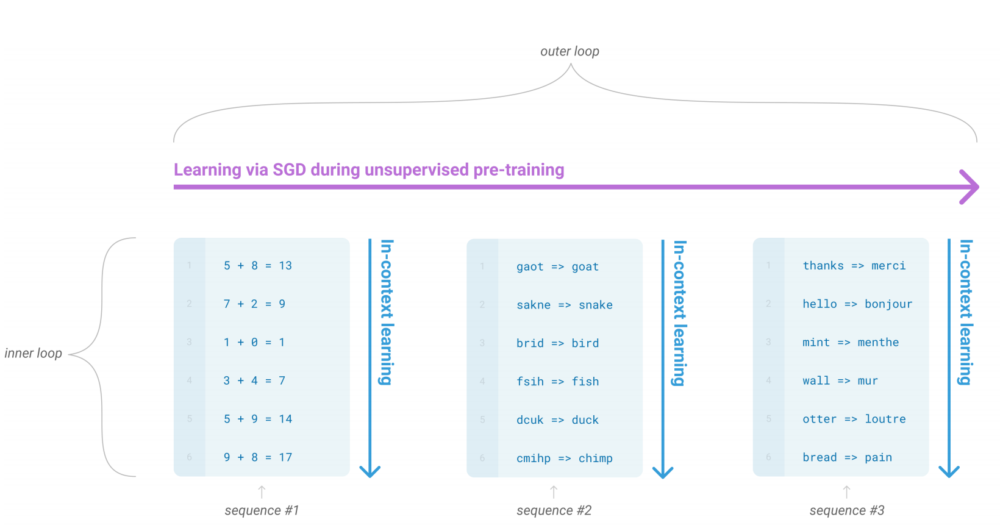
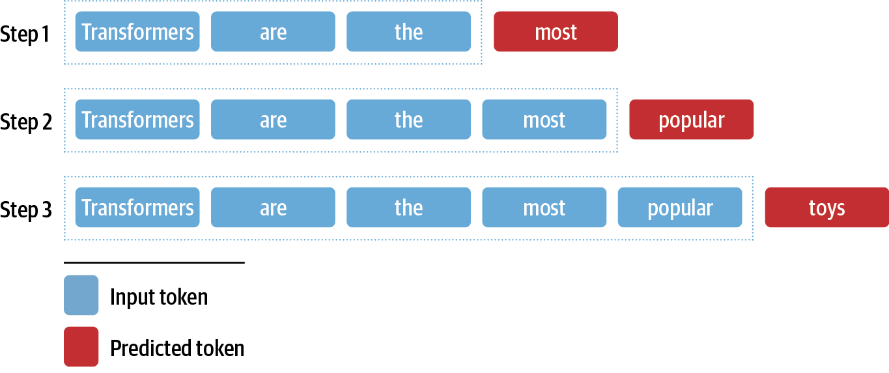
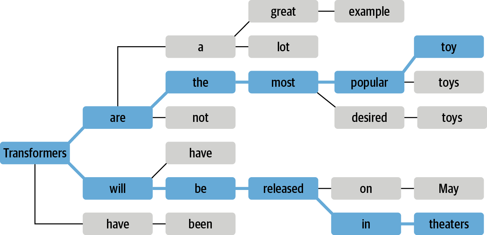

# 今日はみなさんにTarnsformersでのテキスト生成について基本知識を覚えてもらいます

----
# サマリー（今日はこれだけ覚えて帰ろう）
 * GTP-2の基本
   * 超でかい多言語な生成モデル
    * 高い応用力（算術問題や翻訳もできる）
    * TransformersでのGPT-2の使い方 
   * GTP-3とかあるけど違いは？
 * テキスト生成をするときに必要なデコード法（系列サーチ方法）
  * 貪欲法、ビームサーチ、サンプリング法  

-----
# GPT-2の概要

 * 生成モデルってそもそも何やるものなのか？
  * 少量のインプットから続きを書いてくれる（インプットの仕方で算術問題や、翻訳など）してくれる
  * 事前言語モデルは大量のテキストから教示なし学習することで、足し算や表記揺れ解消や翻訳機能を獲得している
 

-----
# GPT-2について（ブログ記事）

 * ググってすぐブログ記事を読むのは良くないかもだがポチッとな。
 * https://developer.mamezou-tech.com/blogs/2022/07/08/gpt-2-japanese/

 * GPTSANとか（こんなのあるんだ）
 * https://github.com/tanreinama/GPTSAN

-----
# GPT-2とGPT-3ととの違いは？

 * GTP-2はTransformerベースの生成モデル。
 * GPT-2とGPT-3との違いはモデルの大きさ
 * https://data-analytics.fun/2020/04/18/understanding-openai-gpt/
   * Transformer
   * Universal Language Model Fine-tuning(ULMFiT) 
 * https://data-analytics.fun/2020/11/10/understanding-openai-gpt2/
 * https://data-analytics.fun/2020/12/07/openai-gpt3/
 * https://www.japio.or.jp/00yearbook/files/2020book/20_5_06.pdf

-----
# テキスト生成タスクの特徴（テキスト分類タスクなどとの比較）
  
  * これまでのタスク（テキスト分類やシーケンスラベリング）では予測値を得るにはモデルがlogits（ロジスティック関数の値/確率pのオッズ比の対数）の値を得て最大値を取るか、ソフトマックス関数を適用すれば良かった
  * 対して、テキスト生成では、モデルの確率値を用いてテキストに変換する必要がある（もう一手間かかる）。
  * デコード手法（入力テキストから別の文字列を出力する処理）が必要。
-----
# 5.1 一貫した内容のテキストを生成するための課題

 * 課題
  * デコードは反復的に行われるので計算量がかかる
  * 生成されるテキストの品質と多様性はデコード手法と関連するはパーパラメータに依存する
  
-----
# テキスト生成の定式化（1/2）

  * GPT-2では（他の生成モデルと同様に）入力トークン列  ${\bf x} = x_{1},...,x_{k}$ に対する 出力トークン列 ${\bf y} = y_{1},...,y_{t}$ の 確率 $P({\bf y}|{\bf x})$ を推定するように事前学習されている（どうやって？　後で調べる）。
  * 連続の確率値を直接推定するのは計算量やデータの制約から難しく、入力文字列 x に対して、それまでの出力系列$y_{t-1}$の時に$y_{t}$が出力する条件付き確率を計算する
$$
\begin{aligned}
P(y_{1},...,y_{t}|{\bf x}) = \prod_{t=1}^{N}　P(y_{t}|y_{1},...,y_{t-1} | {\bf x})
\end{aligned}
$$

  * BERTではマスクされた箇所のトークンを予測していたが、GPT-2では異なる。

-----

# テキスト生成の定式化（1/2）

図 5-3 入力系列から新しい単語を追加していくことてテキスト生成する
 

* 入力系列xからベストな1文字（単語）を追加して、追加した文字列を新たな入力する「条件付きテキスト生成」

-----
# デコード手法の定式化(1/2)
  * （やりたいこと）各時刻でどのトークンを選択するかを決定したい
  * 言語モデルのヘッド（ネットワーク）はある時刻tの語彙トークンごとにロジット$z_{t,i}$を生成する（tは時刻、iは語彙のindex）。
  * ソフトマックスをロジットに適用することにより、次に来そうなトークン$w_{i}$に対する確率分布を得ることができる。
    * softmax関数は複数の出力の合計が1.0とする関数（確率分布になる）
$$
\begin{aligned}
P(y_{t}=w_{i}|y_{<t},{\bf x}) = softmax(z_{t}, i)
\end{aligned}
$$

------
# デコード法の定式化（2/2）
デコード手法の目的は、

$$
\begin{aligned}
{\bf \hat{y} } = argmax_{y} P({\bf y}|{\bf x}) 
\end{aligned}
$$

${\bf \hat{y}}$ を見つけるには、言語モデルで可能な限りの系列を評価する必要がある。これを短時間で実行できるアルゴリズムは存在しないので近似を使う。

------
# 貪欲法によるデコード

$$
\begin{aligned}
{\bf \hat{y} } = argmax_{y} P({\bf y}|{\bf x}) 
\end{aligned}
$$

ではなくて、

$$
\begin{aligned}
\hat{y}  = argmax_{y_{t}} P(y_{t}|y_{<t}, {\bf x}) 
\end{aligned}
$$

で探す。各時刻で最も確率の高いトークンを貪欲に選択する。

-> 実際に試してみよう（Jupyteの結果を確認する）。

-----
# 貪欲法の特徴

   * 「繰り返し」が生じることがある。
   * 長く多様なテキストの生成には使われない。
   * 決定論的な短い算術タスクでは使われる。

-----
# ビームサーチ(1/2)

 * 上位b件の確率値の高いトークン系列候補を保持しておき、最新のトークンの生成時にそれら系列候補を利用する
 * https://ja.wikipedia.org/wiki/%E3%83%93%E3%83%BC%E3%83%A0%E3%82%B5%E3%83%BC%E3%83%81
   * 木構造やグラフから枝刈りをしなが最適解を探索するアルゴリズム
* ビーム数2で検索するの図
 

-----
# ビームサーチ(2/2)

 * log probabilityの和を用いる（積なので計算機ではすぐにアンダーフローになる）
  ->Jupyterへ

 * 高確率のトークンに注目するビームサーチと繰り返しを減らすnグラムペナルティはトレードオフとなる。
 * ビームサーチとngramペナルティは、要約や翻訳などの事実の正確性が重要なアプリケーションでよく使われるとのこと。

-----
# サンプリング手法
 * トークン列の多様性の方が正確性よりも重視される場合には、例えば雑談やストーリー生成では、多様性を改善しつつ繰り返しを減らす方法として、サンプリングが用いられる。
 * Top-KサンプリングとTop-pサンプリングについて解説する。

------
# サンプリング手法の考え方
 * 各時刻で全語彙に対するモデルの出力を確率分布からランダムサンプリングする。確率値は以下の式で示される。
 * $z_{t,i}$はlogit（比率 p のオッズの自然対数のこと） 
$$
\begin{aligned}
P(y_{t}=w_{i}|y_{<t} {\bf x}) = softmax(z_{t,i}) = \frac{ exp(z_{t,i})}{ \sum_{j=1}^{|V|} exp(z_{t,j})}
\end{aligned}
$$

* 対数を再スケールする温度パラメータ Tを追加。出力を制御する。
$$
\begin{aligned}
P(y_{t}=w_{i}|y_{<t} {\bf x}) = \frac{ exp(z_{t,i}/T)}{ \sum_{j=1}^{|V|} exp(z_{t,j}/T)}
\end{aligned}
$$

* ボルツマン分布
http://www.mech.kagoshima-u.ac.jp/~nakamura/bussei/thermo-statistics.pdf

------
# 温度Tによるトークン確率の分布の制御

* 図5-5（jupyterで描画する）
* T<<1すると、原点付近でピークになり、出現頻度が低いトークンが抑制される。
* T >> 1にするt、分布は平坦になりトークンの出現頻度は同程度になる。

------
# 最適なデコード法はあるの？

* 現状、ない 
  * 厳密な正確さを求めるのであれば、サンプリングで温度を下げる、ビームサーチや貪欲法と組み合わせる
  * 長い文章や創造性を求める場合、温度を高める、Top-KとTop-pを組み合わせる、など色々試そう
  
------
# まとめ

 * テキスト生成は分類とは全く異なり出力トークン系列の探索が必要
 * 計算量がかかる、ビームサーチするとさらに
 * 評価どうするの？（目視確認？）
  * 要約の章でBLEUやROUGEといった評価尺度について学べる

------ 
# 疑問（自分内では未解決）

 * GPT-2以外のテキスト生成モデルってなにがあるの？
 * OSSなテキスト生成言語モデルがあるらしい。
  * https://huggingface.co/bigscience/bloom 
 * OPT 
  * https://github.com/facebookresearch/metaseq/tree/main/projects/OPT
 * chatGPTの仕組みは？
 
