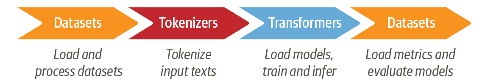

# サマリー（今日はこれだけ覚えて帰ろう）
 * 図2-2 
 * 事前学習言語モデルを用いたテキスト分類のイロハ
   * 事前モデルのデータロード 
   * 自分のタスクの学習データの準備
   * 学習と評価
。。。の手順を覚える

-----
# 目次

 * Transformersでするテキスト分類の特徴の説明
 * Transformersのデータセットを見てみましょう
 * tokenize
 * データの
 * 学習
 * お待ちかねの評価
 * 日本語だとどうなる？
 * ディスカッション
 * よくある質問

-----
# テキスト分類タスクの概要（1/2）

 * Input テキスト → Output:クラスラベル
 * 2値(binary class)分類、多値（muli class）分類
   * 入力テキストがどのクラスかを排他的に分類
   * 例）レビューを「真 or 偽」「松| 竹 | 梅」(品質)に分類
 * 多ラベル（multi label)
   * 入力テキストの分類が複数重複してもOK。タグつけ
   * 例）新聞記事を「政治」「総理大臣」「農業」などでラベル付
     * 実装例）2値分類をカテゴリの数だけ実施する

-----
# テキスト分類の概要（手法の別）
 * ルールベース（キーワードやif文で行う）手法
 * 機械学習モデル（svm、Logistic Regression、Naive Bayes、Decision Tree、lightgbm、XGBoost、DNN…）
   * 学習データ（テキストと正解ラベル）を用いてモデルのパラメータを決める（重み、パラメータ、決定木の形など）

  * （今日の話）DNN系列のTransformerベースのテキスト分類
       * （特徴）
        1. 事前学習言語モデル：事前に大規模テキストで別タスク（穴埋めとか次の文予測とか）のニューラルネットワークを学習済み(出汁)
        2. ユーザは個別の分類タスク用のネットワークを追加し、個別の学習データで学習（fine-tuning）を行う（味付け） 
-------
# Transformers ２章 の テキスト分類

 * サンプルタスクとして以下に取り組む
   * クラスの数は？　multi-class classification
   * データは？　emotion データ
     * sentiment analysis
     * テキストの感情分類。怒ってる？　喜んでる？
      * 補足）極性分類（polarity analysis)という言葉もある。ポジネガ
      * 応用）Voice of customer (VOC) の 分析
   * モデル：DistliBERT
     * 言語は英語
     * 蒸留を使って軽くしたBERT

-------
# Transformersにおけるテキスト分類の流れ

 1. 学習データをロード
 2. テキストをtokenize、token_idのリストにする
 3. 事前学習モデルデータをロード、fine-tuningしたネットワーク調整
 4. 評価データをロード、評価メトリクスを定義して評価

* 一般的な機械学習と何が違いますか？
   * feature enginering がないです。
   * 事前学習モデルのロードです

----

# 2.1 データセット

 * データセットは自前で用意しても良い
 * Hugging Face Datasetsにアップされている

 あとはサンプルコードをぽちぽち操作していきます。 

 * データにはタグが貼り付けてある。
 * licenseに注意
 * train,validation,testの3分割
 （）

-----
# 2.2.2 単語トークン化
 * one_hot_vector操作の意義
 * テキストをtoken化